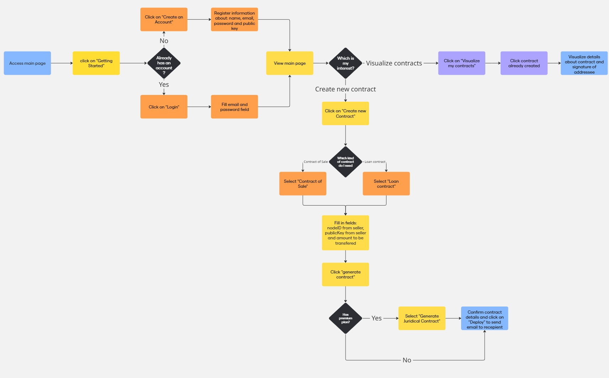
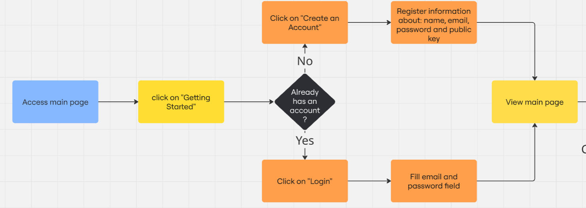
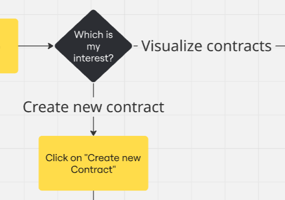
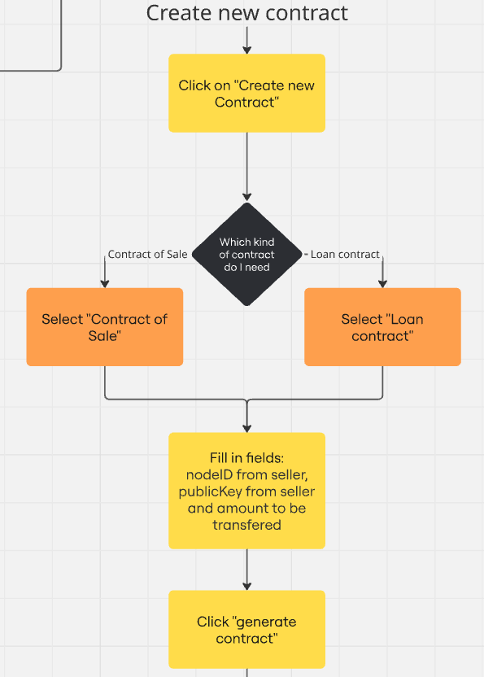
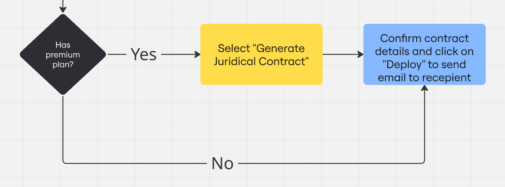

# BTContract

## System Flow

Figure 0X - BPMN Diagram

Source: Material produced by the authors (2025)

This application allows users to create, manage, and deploy Bitcoin-based contracts without needing to know Bitcoin script coding. Similar to platforms like OpenZeppelin, it abstracts the complexity of smart contract creation on the Bitcoin layer, making it accessible to non-technical users.

---
### 1. Account Creation & Authentication

Figure 0X - BPMN Diagram - Part 1

Source: Material produced by the authors (2025)

- Users start by accessing the main page
- They click on "Getting Started"
- If they don't have an account:
  - Click "Create an Account"
  - Register by providing name, email, password, and public key
- If they already have an account:
  - Click "Login"
  - Fill in email and password fields
- After authentication, users are directed to the main view page
---

### 2. Main Navigation Decision

Figure 0X - BPMN Diagram - Part 2

Source: Material produced by the authors (2025)

After login, users can choose between two main paths:
- Visualize existing contracts
- Create new contracts

---

### 3. Visualizing Existing Contracts

Figure 0X - BPMN Diagram - Part 3

Source: Material produced by the authors (2025)

To view existing contracts:
- Click on "Visualize my contracts"
- Select a contract from those already created
- View detailed information about the contract and signature of addressee
---

### 4. Creating New Contracts

Figure 0X - BPMN Diagram - Part 4

Source: Material produced by the authors (2025)

To create a new contract:
- Click on "Create new Contract"
- Choose the type of contract needed:
- Fill in all required fields for the selected contract type
- Click "generate contract" to create the contract

### 5. Contract Deployment

Figure 0X - BPMN Diagram - Part 5

Source: Material produced by the authors (2025)

After generating the contract:
- System checks if user has a premium plan
- If Yes:
  - User can select "Generate Juridical Contract" for enhanced legal features
- If No (or after juridical contract generation):
  - User confirms contract details
  - Clicks "Deploy" to send the contract via email to the recipient

## Key Features
- Simplified contract creation without Bitcoin scripting knowledge
- Two contract types (Sale and Loan) with customizable parameters
- Premium option for juridical contract generation
- Contract visualization tools
- Automated deployment and recipient notification